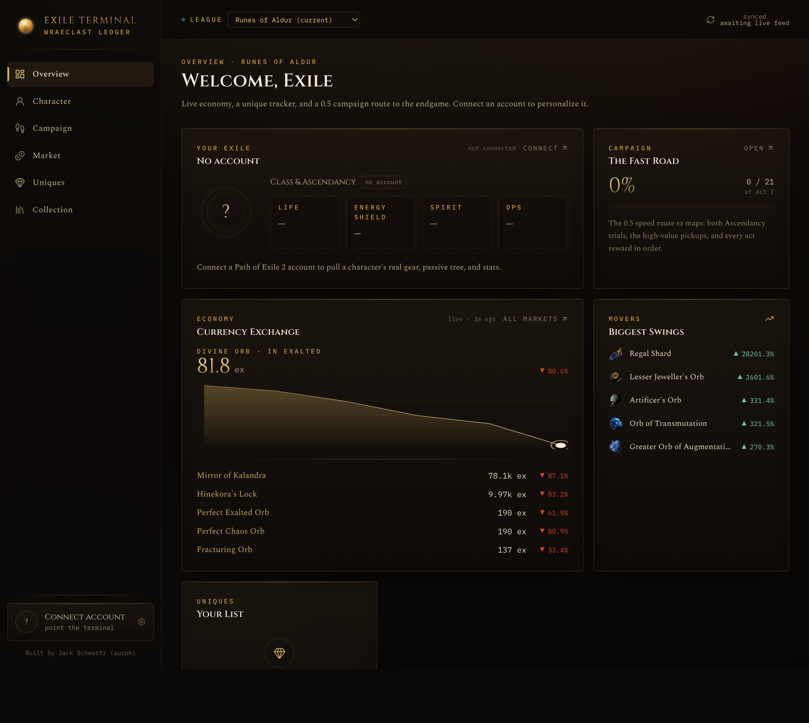
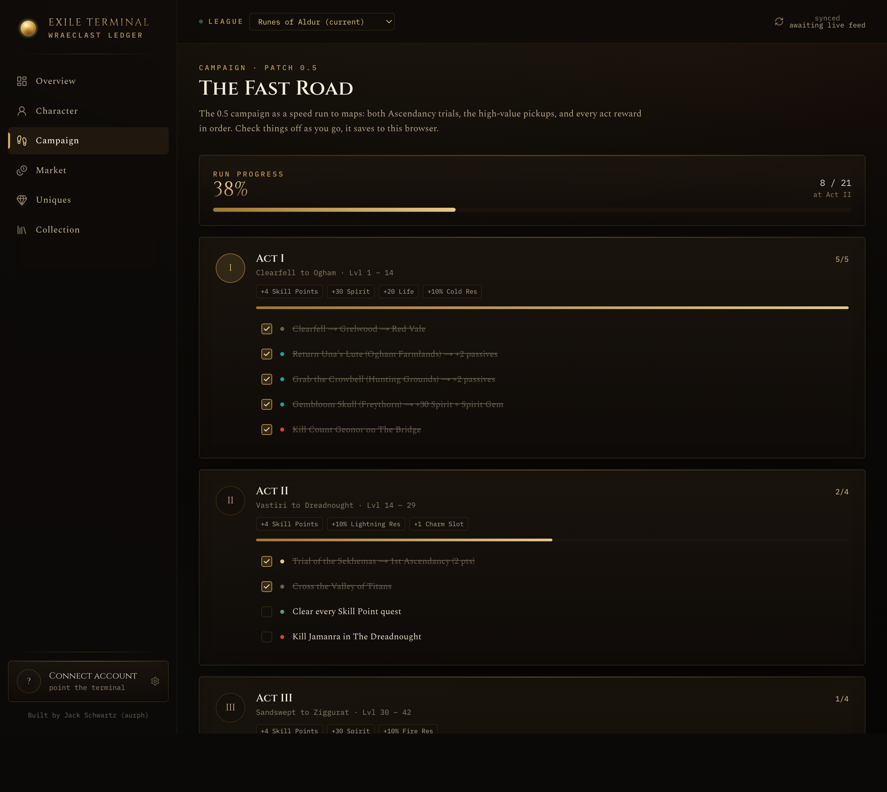

<div align="center">


<h1>Exile Terminal</h1>

<p>
<strong>A command terminal for Path of Exile 2.</strong><br/>
Live economy, a unique-item tracker, a 0.5 campaign route to the endgame, and your
character at a glance — in a dark "Arcane Ledger" interface.
</p>


</div>

<p align="center">
  
</p>

## What's inside

- **Overview** — live economy, market movers, campaign progress, and your unique tracker, all on one screen.
- **Character** — paste a Path of Building 2 export and get a defenses radar, vitals, and a weak-spot audit. No login; the build is stored in your browser's localStorage.
- **Campaign** — the 0.5 speed route to maps as visual act cards with clickable milestones (both Ascendancy trials, key pickups, every act reward). Progress lives in a browser cookie you own — it survives refreshes and redeploys.
- **Market** — the full currency exchange with sparklines, categories, search, and pagination.
- **Uniques** — the whole catalog with live prices, real substring search (with cross-category hits), plus a have / want / chasing tracker.
- **Oracle** *(optional)* — a tool-calling Claude assistant over live prices, your tracker, and web search. Off unless you add an API key; it powers the Build Guides, Codex, and 0.5 Changes pages.

<p align="center">
  
</p>

## Data sources

- **[poe2scout.com](https://poe2scout.com)** — live currency and unique prices. No key needed.
- **Path of Building 2** — character import. Paste an export code or `pobb.in` link; PoB2 has already computed the stats, so nothing is logged in to GGG.
- **Anthropic Claude API** *(optional)* — the Oracle and the Oracle-powered pages. Needs `ANTHROPIC_API_KEY`.
- **Web search** — a server-side tool the Oracle uses for current-patch facts.

## Run locally

```bash
npm install
npm run dev      # http://localhost:3000
```

The app is fully usable with **no secrets at all**: Overview, Character, Campaign, Market, and Uniques are live out of the box. The Oracle pages light up once you add a key.

## Configuration

Create `.env.local` (gitignored), or set these in your deployment environment:

| Variable | Required | Purpose |
| --- | --- | --- |
| `ANTHROPIC_API_KEY` | for AI features | Powers the Oracle, Build Guides, and 0.5 Changes. Get one at console.anthropic.com. |
| `ORACLE_MODEL` | optional | Oracle model. Defaults to `claude-opus-4-8`. Use `claude-sonnet-4-6` or `claude-haiku-4-5` to cut cost. |
| `NEXT_PUBLIC_POE_ACCOUNT` | optional | Default account label. |
| `NEXT_PUBLIC_POE_CHARACTER` | optional | Default character label. |
| `NEXT_PUBLIC_POE_LEAGUE` | optional | Fallback league label. The live league is detected automatically. |

### Connecting your character

Open Path of Building 2, build or import your character, then **Import/Export → Generate** and copy the code (or a `pobb.in` link). Paste it into the Character page. Because PoB2 pre-computes the stats, the radar reads them exactly, and there is no GGG sign-in.

## Deploy

Any Node host works:

```bash
npm install
npm run build
npm start
```

Set the environment variables above in your host's secrets store.

## Notes

- No login and no server-side user storage at all. Campaign progress and the uniques tracker are compact cookies the browser writes itself; the imported build is localStorage. Your data survives refreshes, server restarts, and redeploys because it never leaves your browser.
- **Save codes** (Account page): export progress + tracker + build as one `EXILE1.` string, PoB-style. Move it to another browser or keep it as a backup. The Campaign page has a reset button for new leagues.
- Search is done locally against cached poe2scout data (the upstream search param only matches exact full names, so the app never uses it).
- External data is cached in-process with a short TTL, retried once on failure, and falls back to the last good value on a failed fetch.
- Not affiliated with or endorsed by Grinding Gear Games. Path of Exile and Path of Exile 2 are trademarks of Grinding Gear Games. The orb mark is an original rendition, not GGG artwork.

---

<div align="center">
By <a href="https://github.com/aurph">Jack Schwartz</a> (aurph). Built with <a href="https://claude.com/claude-code">Claude</a>.
</div>
